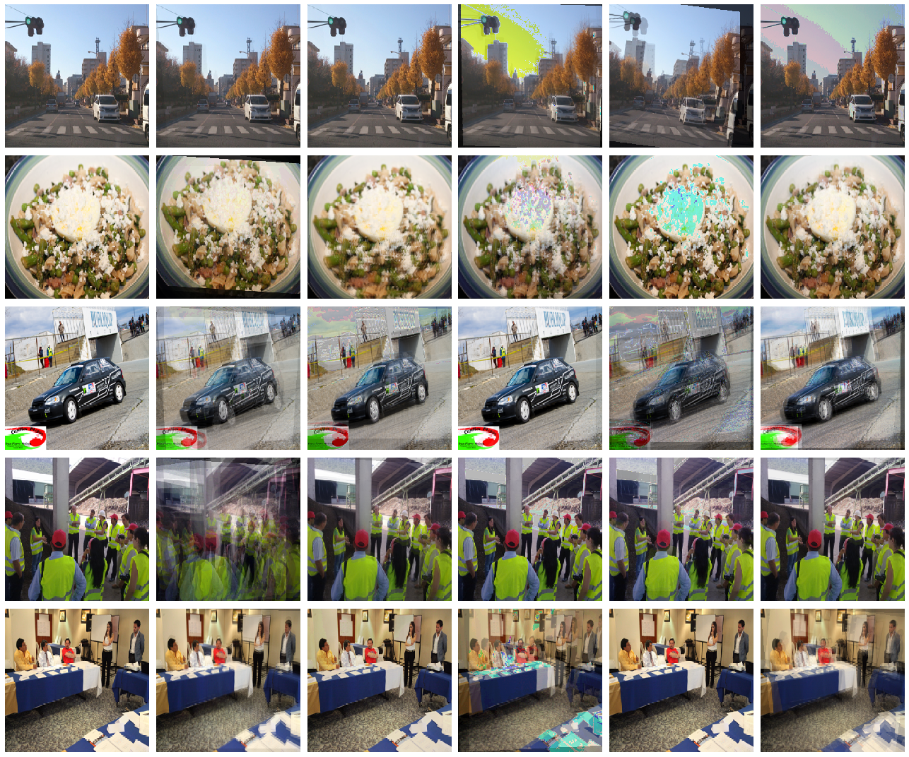

# Project description

This repository contains demo of AUGMIX augmentation images with [demo code](demo.ipynb) how to use in your code.

# Changes

The code was forked from [google-research/augmix](https://github.com/google-research/augmix).  
Since some of normalizations were making output image un-demo-able I removed normalization code from the orginal pipeline.

# Results

Sample results processed by the demo notebook code is (first column is the original image, then 5 augmented samples):  

---
AUGMIX code: Copyright 2019 Google LLC  
Paper: **"[A Simple Data Processing Method to Improve Robustness and Uncertainty](https://arxiv.org/pdf/1912.02781.pdf)"**  
Authors: Hendrycks, Dan and Mu, Norman and Cubuk, Ekin D. and Zoph, Barret and Gilmer, Justin and Lakshminarayanan, Balaji  
